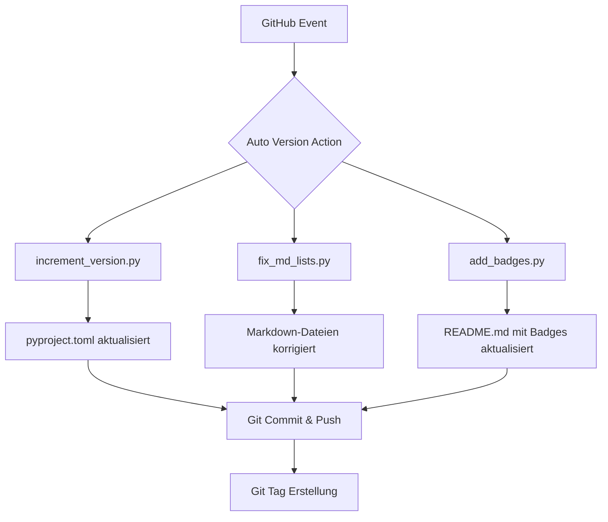
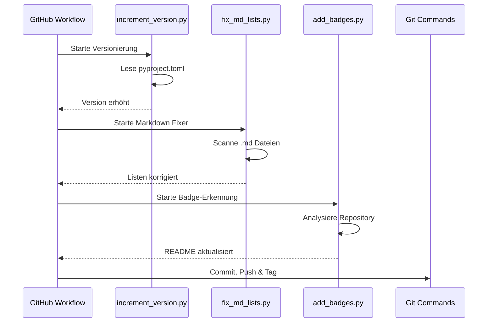

# Architektur

Dieses Dokument beschreibt den Aufbau und den Datenfluss der Auto Version Action.

## Systemübersicht

Die Action besteht aus drei Hauptkomponenten, die nacheinander ausgeführt werden.

## Datenfluss

Der Datenfluss konzentriert sich auf die Analyse des Repository-Status und die anschließende Modifikation von Metadaten und Dokumentation.

