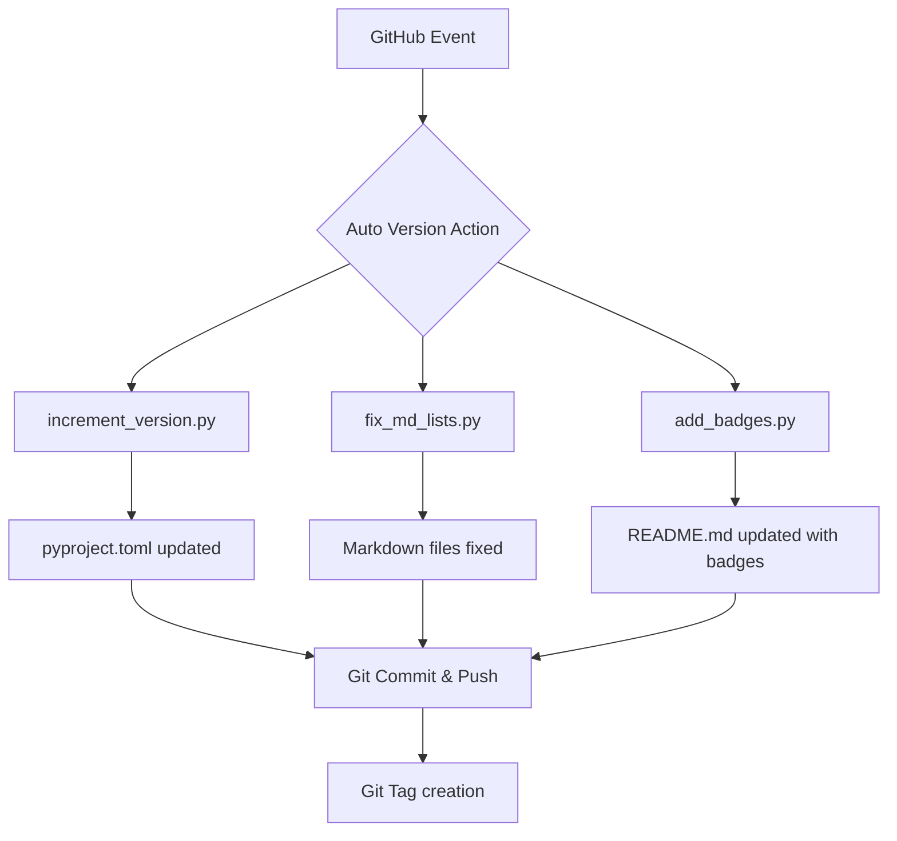
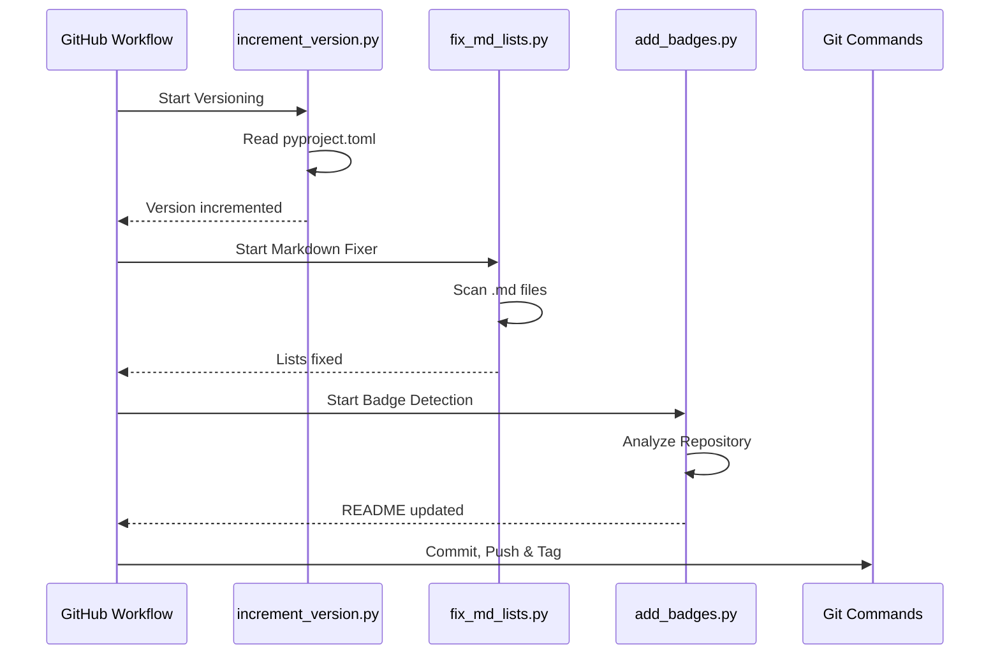

# Architecture

This document describes the structure and data flow of the Auto Version Action.

## System Overview

The action consists of three main components executed sequentially.

## Data Flow

The data flow focuses on analyzing the repository status and subsequently modifying metadata and documentation.

